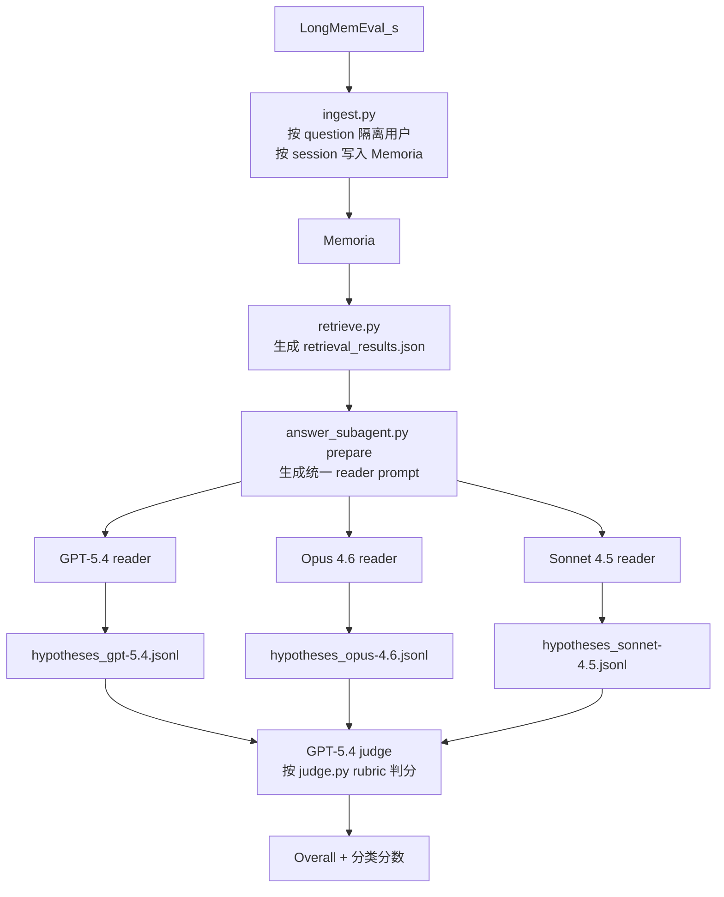

# Memoria × LongMemEval 统一 Judge 报告

> 日期：2026-04-02
> 目的：在固定 Memoria 检索结果上，对比 3 个 reader 的效果
> 结果目录：`benchmarks/longmemeval/results/`

## 1. 数据集

- 数据集：`LongMemEval_s`
- 数据文件：`benchmarks/longmemeval/data/longmemeval_s_cleaned.json`
- 原始 retrieval 结果：`benchmarks/longmemeval/results/retrieval_results.json`

本次 snapshot 的数据范围：

- `500` 条 retrieval 记录
- 每题固定返回 `10` 条 memory
- 其中 `1` 题 retrieval 超时：`db467c8c`
- 因此最终进入 reader / judge 的样本数为 **499**

LongMemEval 的 6 个主类别如下：

| 类别 | 缩写 | 数量 |
| --- | --- | ---: |
| Single-Session User | SSU | 70 |
| Single-Session Assistant | SSA | 56 |
| Single-Session Preference | SSP | 30 |
| Knowledge Update | KU | 77 |
| Temporal Reasoning | TR | 133 |
| Multi-Session | MS | 133 |

另有 `Abstention` 交叉类别，共 `30` 题。它是 499 题中的一个子集，不是额外增加的题数。

## 2. 测试流程

### 2.1 角色说明

| 角色 | 含义 |
| --- | --- |
| Memoria | 被测试的 memory backend，负责 ingest 和 retrieve |
| Reader | 读取 Memoria 检索结果并生成最终答案的模型 |
| Judge | 根据标准答案和模型回答，判断该题是否正确的模型 |

本次实际使用的 reader / judge：

| 层             | 配置                                                      |
| ------------- | ------------------------------------------------------- |
| Memory system | `Memoria`                                               |
| Reader 1      | `gpt-5.4`                                               |
| Reader 2      | `claude-opus-4.6`                                       |
| Reader 3      | `claude-sonnet-4.5`                                     |
| Judge         | `gpt-5.4`                                               |
| Judge rubric  | `benchmarks/longmemeval/judge.py` 中的 LongMemEval 官方题型规则 |

### 2.2 流程图

### 2.3 实际执行步骤

1. 用 `ingest.py` 把 LongMemEval_s 的历史 session 写入 Memoria。
2. 用 `retrieve.py` 为每个问题从 Memoria 检索相关记忆，生成 `retrieval_results.json`。
3. 用 `answer_subagent.py prepare` 基于同一份 retrieval snapshot 生成 reader prompt。
4. 三个 reader 在完全相同的 retrieval 结果上分别回答，生成各自的 `hypotheses_*.jsonl`。
5. 三个 hypotheses 再统一交给 `gpt-5.4` judge，根据 `judge.py` 的官方题型规则打分。

### 2.4 Prompt 说明

| 对象                          | Prompt 说明                                                                                                                                                                                                                                                                                                                                                                             |
| --------------------------- | ------------------------------------------------------------------------------------------------------------------------------------------------------------------------------------------------------------------------------------------------------------------------------------------------------------------------------------------------------------------------------------- |
| Reader 通用 prompt            | 有。来自 `benchmarks/longmemeval/answer_subagent.py`。内容包括：问题、问题日期、检索到的 memory 列表（含 `Observed At`、`Retrieval Score`、内容正文），并要求模型仅基于给定 context 回答；如果信息不足，可以回答 `I don't know` 或说明缺少什么信息。                                                                                                                                                                                                      |
| `gpt-5.4` 额外 reader prompt  | 有。该 run 在通用 reader prompt 末尾追加如下原文约束：`Additional response rules:` `- Start with the direct answer in the first sentence.` `- If retrieved memories conflict, prefer the most recent information by Observed At.` `- If the context is insufficient or ambiguous, respond exactly: I don't know.` `- Do not mention retrieval scores, session IDs, or memory numbers.` |
| `opus-4.6` 额外 reader prompt | 有。Kiro CLI 运行时在通用 reader prompt 末尾追加约束：`Return only the final answer text. If the context does not contain enough information, respond exactly: I don't know. Do not explain. Do not cite memories. Do not add any preface.`                                                                                                                                                          |
| Reader system prompt        | 无                                                                                                                                                                                                                                                                                                                                                                                     |
| Judge prompt                | 有。来自 `benchmarks/longmemeval/judge.py`，使用 LongMemEval 官方按题型区分的 judge prompt：`SSU/SSA/MS` 判断回答是否包含正确答案；`TR` 允许日期/周数等 off-by-one；`KU` 允许旧信息出现但要求包含最新答案；`SSP` 按个性化 rubric 判断；`Abstention` 判断模型是否正确识别问题不可答。                                                                                                                                                                               |
| Judge system prompt         | 无                                                                                                                                                                                                                                                                                                                                                                                     |

## 3. 指标含义

| 指标 | 含义 |
| --- | --- |
| Overall | 总准确率，等于 `Correct Count / Overall Count` |
| Correct Count | 被 judge 判为正确的题数 |
| Overall Count | 参与 judge 的总题数，本次为 `499` |
| IDK Count | reader **精确输出** `I don't know` 的次数（不包含 `I don't know.` 等变体） |
| SSU | 单会话用户信息题，考察是否能从单次会话中找出用户明确说过的事实 |
| SSA | 单会话助手信息题，考察是否能找出 assistant 曾给出的建议、步骤、链接等 |
| SSP | 单会话偏好题，考察是否能正确利用用户偏好进行个性化回答 |
| KU | 知识更新题，考察是否能在新旧信息冲突时使用最新信息 |
| TR | 时间推理题，考察时间线、间隔、先后顺序等推理能力 |
| MS | 多会话题，考察是否能把多个 session 里的信息整合起来回答 |
| Abstention | 对不可答问题的正确拒答率；它是 499 题中的 30 题子集 |

补充说明：

- `SSU + SSA + SSP + KU + TR + MS = 499`
- `Abstention` 不是额外题数，而是交叉统计
- `IDK Count` 不是官方主分数，但能反映模型是更保守还是更激进

## 4. 最终结果

### 4.1 Overall 结果

| Reader run   | Reader              | Judge     | Correct | Overall | IDK Count |
| ------------ | ------------------- | --------- | ------: | ------: | --------: |
| `gpt-5.4`    | `gpt-5.4`           | `gpt-5.4` | 424/499 |  84.97% |         3 |
| `opus-4.6`   | `claude-opus-4.6`   | `gpt-5.4` | 443/499 |  88.78% |         0 |
| `sonnet-4.5` | `claude-sonnet-4.5` | `gpt-5.4` | 353/499 |  70.74% |        79 |

``### 4.2 分类结果

| Reader       |        SSU |        SSA |       SSP |        KU |        TR |        MS | Abstention |
| ------------ | ---------: | ---------: | --------: | --------: | --------: | --------: | ---------: |
| `gpt-5.4`    |      98.57 | **100.00** | **86.67** |     77.92 |     88.72 |     71.43 |      56.67 |
| `opus-4.6`   | **100.00** | **100.00** |     76.67 | **89.61** | **90.23** | **78.95** |  **93.33** |
| `sonnet-4.5` |      95.71 | **100.00** |     43.33 |     58.44 |     64.66 |     64.66 |      86.67 |

## 5. 关键结果文件

- `benchmarks/longmemeval/results/hypotheses_gpt-5.4-v1-direct-latest-full499.jsonl`
- `benchmarks/longmemeval/results/hypotheses_opus-4.6-kiro-rerun32.jsonl`
- `benchmarks/longmemeval/results/hypotheses_sonnet-4.5-rerun32.jsonl`
- `benchmarks/longmemeval/results/judge_results_gpt-5.4_gpt-5.4-v1-direct-latest-full499_subagent.json`
- `benchmarks/longmemeval/results/judge_summary_gpt-5.4_gpt-5.4-v1-direct-latest-full499_subagent.json`
- `benchmarks/longmemeval/results/judge_summary_gpt-5.4_opus-4.6-kiro-rerun32_subagent.json`
- `benchmarks/longmemeval/results/judge_summary_gpt-5.4_sonnet-4.5-rerun32_subagent.json`
